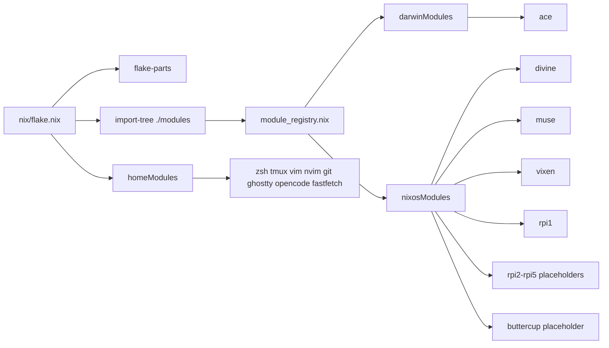

<div align="center">
  <h1>infra</h1>
  <p><strong>Homelab, workstation, and service orchestration from one Nix flake.</strong></p>
  <p>macOS on the desk, NixOS in the rack, Raspberry Pi at the edge, and a handful of storage and media boxes behind it.</p>
  <p>
    
    
    
    
  </p>
</div>

<p align="center">
  <a href="#overview">Overview</a> |
  <a href="#repository-map">Repository Map</a> |
  <a href="#host-inventory">Host Inventory</a> |
  <a href="#deployment-flow">Deployment Flow</a> |
  <a href="#nix-layout">Nix Layout</a> |
  <a href="#scripts">Scripts</a> |
  <a href="#secrets">Secrets</a> |
  <a href="#reality-check">Reality Check</a>
</p>

---

## Overview

This repository is the control plane for a personal environment that mixes:

- `nix-darwin` for the daily macOS machine
- `home-manager` for shell, editor, and terminal UX
- `NixOS` for homelab nodes
- `disko`, `mdadm`, `mergerfs`, and `snapraid` for storage-heavy hosts
- `agenix` for encrypted secrets
- thin deployment wrappers in [`scripts/`](./scripts) around `nh`

The center of gravity is [`nix/`](./nix). That is where the flake, reusable modules, and per-host compositions live. [`scripts/`](./scripts) adds the operator workflow on top: one script for Darwin, one script for remote NixOS hosts.

If you want to understand the repo fast, read it in this order:

1. [`nix/flake.nix`](./nix/flake.nix)
2. [`nix/modules/core/module_registry.nix`](./nix/modules/core/module_registry.nix)
3. [`nix/modules/hosts/`](./nix/modules/hosts)
4. [`scripts/deploy_macos.sh`](./scripts/deploy_macos.sh) and [`scripts/deploy_remote.sh`](./scripts/deploy_remote.sh)

---

## At A Glance

| Area | Purpose | Main files |
| --- | --- | --- |
| Flake entrypoint | Defines inputs and imports the entire module tree with `import-tree` and `flake-parts` | [`nix/flake.nix`](./nix/flake.nix) |
| Reusable system modules | Shared Darwin and NixOS building blocks | [`nix/modules/core`](./nix/modules/core), [`nix/modules/linux`](./nix/modules/linux), [`nix/modules/macos`](./nix/modules/macos) |
| Packages and home-manager bundles | Shell, editor, terminal, Git, and CLI UX | [`nix/modules/packages`](./nix/modules/packages) |
| Host compositions | Actual machines and their storage/service roles | [`nix/modules/hosts`](./nix/modules/hosts) |
| Deploy entrypoints | Thin wrappers around `nh` for switch/build/test flows | [`scripts/deploy_macos.sh`](./scripts/deploy_macos.sh), [`scripts/deploy_remote.sh`](./scripts/deploy_remote.sh) |
| Secrets | Encrypted payloads and recipient mapping | [`secerts/`](./secerts) |
| Editor config | Neovim config linked into home-manager out-of-store | [`dotfiles/nvim`](./dotfiles/nvim) |
| Extra experiments | Supplemental Nix snippets and Terraform bits | [`supplemental/`](./supplemental), [`terraform/`](./terraform) |

---

## Architecture



The design is intentionally simple:

- `flake.nix` defines inputs and delegates nearly everything else.
- `import-tree ./modules` bulk-imports the module tree.
- `module_registry.nix` turns internal `moduleRegistry.{darwin,nixos}` attributes into exported `flake.darwinModules` and `flake.nixosModules`.
- Host files under `nix/modules/hosts/**` assemble machines from those modules.
- Home-manager modules are exported independently under `flake.homeModules.*`.

That gives the repo a nice split:

- OS-level policy lives in reusable modules.
- Machine identity lives in host files.
- Deployment behavior lives in shell scripts.

---

## Repository Map

```text
.
|-- README.md
|-- dotfiles/
|   `-- nvim/
|-- nix/
|   |-- flake.nix
|   |-- flake.lock
|   |-- Justfile
|   `-- modules/
|       |-- core/
|       |-- hosts/
|       |   |-- mac/
|       |   |-- rpi/
|       |   `-- server/
|       |-- linux/
|       |-- macos/
|       |-- packages/
|       |-- programs/
|       `-- services/
|-- scripts/
|   |-- deploy_macos.sh
|   `-- deploy_remote.sh
|-- secerts/
|-- supplemental/
`-- terraform/
    `-- k8s/
```

### Top-level intent

- [`nix/`](./nix) is the actual product.
- [`scripts/`](./scripts) is the operator interface.
- [`secerts/`](./secerts) is the encrypted state that lets services boot correctly.
- [`dotfiles/`](./dotfiles) only shows up where a tool is intentionally managed out-of-store, most notably Neovim.
- [`supplemental/`](./supplemental) looks like a scratchpad/reference area for additional Nix snippets.
- [`terraform/`](./terraform) is adjacent infrastructure work, not part of the main flake deployment path.

---

## Host Inventory

### Exported By The Flake

These are the currently exported host names observed from `nix eval ./nix#...`.

| Host | Platform | Status | Role | Highlights |
| --- | --- | --- | --- | --- |
| `ace` | `aarch64-darwin` | active | Primary workstation | `nix-darwin`, `home-manager`, Homebrew, Ghostty, Opencode, Neovim, Git, tmux |
| `divine` | `x86_64-linux` | active | GPU and storage node | NVIDIA/CUDA stack, `ollama`, Samba, `mergerfs`, `mdadm` RAID1, NFS exports |
| `muse` | `x86_64-linux` | active | Storage/archive box | NVIDIA stack, Samba, `mergerfs`, `snapraid` |
| `vixen` | `x86_64-linux` | active | Media server | NVIDIA stack, Samba, Jellyfin, Stash, CUDA ffmpeg wrapper, `mergerfs`, `snapraid` |
| `rpi1` | `aarch64-linux` | active | Raspberry Pi utility node | Home Assistant, RPi boot tweaks, shared shell/user config |
| `rpi2` | placeholder output | placeholder | Reserved slot | Empty host file today |
| `rpi3` | placeholder output | placeholder | Reserved slot | Empty host file today |
| `rpi4` | placeholder output | placeholder | Reserved slot | Empty host file today |
| `rpi5` | placeholder output | placeholder | Reserved slot | Empty host file today |
| `buttercup` | placeholder output | placeholder | Legacy or in-progress host | Comes from [`nix/modules/hosts/mac/mac_luffy.nix`](./nix/modules/hosts/mac/mac_luffy.nix), but currently defines an empty NixOS config |

### Present In The Working Tree But Not Yet Exported

| Host | State | Notes |
| --- | --- | --- |
| `trinity` | local work in progress | A full server definition exists under [`nix/modules/hosts/server/trinity`](./nix/modules/hosts/server/trinity), including `snapraid`, Samba, and `autossh` tunnels, but it is not currently part of exported flake outputs because the files are still untracked in git |

### Machine Notes

#### `ace`

The Darwin workstation is the most polished endpoint in the repo:

- uses `nix-homebrew` to manage taps declaratively
- pulls in `home-manager` modules for shell/editor UX
- installs GUI apps through Homebrew casks
- points local AI tooling at `divine` through `OLLAMA_HOST=192.168.2.5`

#### `divine`

This is a mixed compute and storage node:

- `nvidia_gpu` for CUDA-enabled workloads
- `ollama` exposed on `0.0.0.0:11434`
- Samba share for `/mnt/mergefs`
- `mdadm` mirrored SSD array mounted at `/mnt/ssd`
- NFS exports for `/mnt/ssd` and `/mnt/nvme1`
- `mergerfs` spanning two HDD mounts under `/mnt/weed/*`

#### `muse`

This machine is a classic storage box:

- multiple XFS data disks
- `mergerfs` pool at `/mnt/mergefs`
- single parity disk through `snapraid`
- Samba sharing on top of the merged pool

#### `vixen`

This is the media-heavy node:

- Samba for network file access
- Jellyfin with NVENC transcoding
- Stash with encrypted credentials and optional CUDA ffmpeg wrapper
- `snapraid` plus `mergerfs` for the media pool

#### `rpi1`

This is the only Raspberry Pi host that currently has real configuration behind it:

- generic shared user/system config
- Pi-compatible bootloader overrides
- Home Assistant enabled

---

## Deployment Flow

There are two canonical operator paths in this repo.

### 1. Darwin Switches

For the macOS machine:

```bash
./scripts/deploy_macos.sh ace
```

What the script does:

1. resolves the repository root
2. checks whether `nh` exists locally
3. runs either `nh darwin switch "$ROOT/nix#ace"` or `nix run nixpkgs#nh darwin switch "$ROOT/nix#ace"`

That means the script stays intentionally thin. It does not add extra state, logging layers, or host discovery.

### 2. Remote NixOS Deployments

For remote Linux machines:

```bash
./scripts/deploy_remote.sh divine
./scripts/deploy_remote.sh muse test
./scripts/deploy_remote.sh vixen build
```

Supported actions:

- `switch`
- `boot`
- `test`
- `build`

What [`scripts/deploy_remote.sh`](./scripts/deploy_remote.sh) does:

1. resolves the repo root
2. validates the hostname against a hard-coded host/IP map
3. creates `~/infra-nixos` on the target host
4. `rsync`s the repo to the target, excluding `.git`, `.terraform`, and `result*`
5. runs `nh os <action> "$FLAKE_DIR/nix#<hostname>"` with both `--target-host` and `--build-host` set to the remote machine

That final detail matters: builds happen on the remote machine, not on the operator laptop.

Also worth noting: the script still `rsync`s the repo to `~/infra-nixos`, but the active `nh` invocation uses the local flake path, not the copied remote checkout. The older SSH-into-remote-shell flow is still present as commented code.

### Current Remote Host Map

The deploy script currently knows about:

| Host | IP |
| --- | --- |
| `rpi1` | `192.168.2.80` |
| `rpi2` | `192.168.2.81` |
| `rpi3` | `192.168.2.82` |
| `rpi4` | `192.168.2.83` |
| `rpi5` | `192.168.2.84` |
| `vixen` | `192.168.2.4` |
| `divine` | `192.168.2.5` |
| `muse` | `192.168.2.6` |

Notably absent:

- `ace`, which is handled by the Darwin script
- `trinity`, which exists locally but is not yet wired into the deploy script

### Direct Commands Without The Wrapper Scripts

If you want to bypass the shell wrappers, the flake is still straightforward to drive manually:

```bash
nix flake show ./nix
nix eval --json ./nix#darwinConfigurations --apply builtins.attrNames
nix eval --json ./nix#nixosConfigurations --apply builtins.attrNames
```

With `nh` installed:

```bash
nh darwin switch ./nix#ace
nh os switch ./nix#divine --hostname divine
```

---

## Nix Layout

### Flake Entry

[`nix/flake.nix`](./nix/flake.nix) is compact on purpose.

It brings in:

- `flake-parts`
- `nixpkgs`
- `nix-darwin`
- `home-manager`
- `nix-homebrew`
- `disko`
- `agenix`
- `import-tree`

And then it mostly says:

- support Darwin and Linux on both `x86_64` and `aarch64`
- import the entire `./modules` tree
- let modules declare flake outputs

That makes the flake feel more like a registry than a giant hand-written `outputs = { ... }` block.

### Core Modules

| Module | Purpose |
| --- | --- |
| [`core/module_registry.nix`](./nix/modules/core/module_registry.nix) | Exports internal module registries as `flake.darwinModules` and `flake.nixosModules` |
| [`core/config.nix`](./nix/modules/core/config.nix) | Shared user, hostname, shell, locale, Nix settings, and environment defaults |
| [`core/shell_alias.nix`](./nix/modules/core/shell_alias.nix) | Cross-platform shell aliases for Git, file navigation, search, Terraform, and quality-of-life commands |
| [`core/shell_functions.nix`](./nix/modules/core/shell_functions.nix) | Tiny shell utilities like `x`, `dirsize`, and `extract` packaged as system binaries |

### OS Modules

| Module | Purpose |
| --- | --- |
| [`linux/system.nix`](./nix/modules/linux/system.nix) | Shared NixOS base: bootloader defaults, OpenSSH, Avahi, NetworkManager, user setup, Nix settings |
| [`linux/rpi.nix`](./nix/modules/linux/rpi.nix) | Raspberry Pi bootloader overrides using extlinux instead of systemd-boot |
| [`linux/nvidia_gpu.nix`](./nix/modules/linux/nvidia_gpu.nix) | NVIDIA driver stack, CUDA toolchain, VAAPI bridge, GPU env vars |
| [`macos/macos_config.nix`](./nix/modules/macos/macos_config.nix) | `nix-darwin` defaults for Dock, Finder, keyboard repeat, trackpad, tmux temp directory, and machine naming |
| [`macos/homebrew.nix`](./nix/modules/macos/homebrew.nix) | Declarative Homebrew management through `nix-homebrew` |

### Home Modules

The flake currently exports these reusable `home-manager` modules:

| Home module | What it manages |
| --- | --- |
| `autojump` | shell navigation |
| `fastfetch` | system summary output |
| `ghostty` | terminal config |
| `git` | Git, Delta, Lazygit, Mergiraf |
| `lf` | terminal file manager |
| `nvim` | Neovim package set and out-of-store config link |
| `opencode` | Opencode TUI and Ollama provider wiring |
| `tmux` | tmux config and plugins |
| `vim` | fallback Vim config |
| `zsh` | shell behavior, prompt, completions, PATH, editor selection |

### Service And Program Modules

| Module | Purpose | Used by |
| --- | --- | --- |
| [`services/home_assistant.nix`](./nix/modules/services/home_assistant.nix) | Home Assistant base setup | `rpi1` |
| [`services/ollama.nix`](./nix/modules/services/ollama.nix) | local LLM endpoint using `ollama-cuda` | `divine` |
| [`services/samba.nix`](./nix/modules/services/samba.nix) | SMB share with macOS-friendly `fruit` tuning and password bootstrapping | `divine`, `muse`, `vixen`, local `trinity` |
| [`programs/jellyfin.nix`](./nix/modules/programs/jellyfin.nix) | GPU-accelerated Jellyfin service | `vixen` |
| [`programs/stash.nix`](./nix/modules/programs/stash.nix) | Stash service, secret wiring, and optional CUDA ffmpeg wrapper | `vixen` |

### Package Bundles

There are two main shared system package layers:

| Module | Intent |
| --- | --- |
| [`packages/common_packages.nix`](./nix/modules/packages/common_packages.nix) | day-to-day CLI basics like `bat`, `curl`, `eza`, `fd`, `fzf`, `jq`, `ripgrep`, `tree`, `wget` |
| [`packages/advanced_packages.nix`](./nix/modules/packages/advanced_packages.nix) | developer and infra tools like `go`, `gcc`, `kubectl`, `nodejs_22`, `pnpm`, `uv`, `nh`, `ollama`, and `agenix` |

### Storage Pattern

This repo has a clear opinionated storage story for Linux servers:

| Host | Pattern |
| --- | --- |
| `divine` | `mdadm` RAID1 SSD mirror + dedicated NVMe + `mergerfs` over HDDs + NFS exports |
| `muse` | multiple data disks + `snapraid` parity + `mergerfs` pool |
| `vixen` | media disks + `snapraid` parity + `mergerfs` pool + GPU media workloads |
| local `trinity` | same broad pattern as `muse`, plus persistent AutoSSH tunnels |

That combination is practical for homelab storage:

- `mergerfs` gives a single pooled view
- `snapraid` handles parity on mostly-static data
- Samba sits at the top for network access
- some hosts add media or AI workloads on top of the same pool

---

## Scripts

The [`scripts/`](./scripts) directory is intentionally small. These scripts are wrappers, not full deployment frameworks.

### `deploy_macos.sh`

File: [`scripts/deploy_macos.sh`](./scripts/deploy_macos.sh)

Purpose:

- switch a Darwin configuration from the local machine

Behavior:

- assumes the first argument is the host name
- computes the repo root dynamically
- prefers local `nh`
- falls back to `nix run nixpkgs#nh`

Example:

```bash
./scripts/deploy_macos.sh ace
```

### `deploy_remote.sh`

File: [`scripts/deploy_remote.sh`](./scripts/deploy_remote.sh)

Purpose:

- push the repo to a remote host
- run a remote `nh os switch|boot|test|build`

Behavior:

- uses a hard-coded associative array of host names to IPs
- validates host name and action before doing any work
- syncs the repo via `rsync`
- uses SSH user `reezpatel`
- builds on the remote host
- currently keeps a staged remote checkout even though the active `nh` command still points at the local flake path

Example:

```bash
./scripts/deploy_remote.sh divine switch
./scripts/deploy_remote.sh vixen test
./scripts/deploy_remote.sh muse build
```

### Why These Scripts Matter

They encode the operational assumptions of the repo:

- one operator identity
- known static LAN addresses
- flake root is `./nix`
- remote state should be refreshed by `rsync` before activation
- `nh` is the preferred frontend, but not a hard prerequisite

That is small, but it is exactly the right level of abstraction for a personal homelab.

---

## Secrets

Encrypted secrets live in [`secerts/`](./secerts).

Current secret files:

- `dev-rsa.age`
- `ppd-rsa.age`
- `private-func.age`
- `samba-password.age`
- `stash-jwt-key.age`
- `stash-session-key.age`
- `stash-password.age`

Recipients are declared in [`secerts/secrets.nix`](./secerts/secrets.nix).

### Where Secrets Are Used

| Secret | Consumed by | Purpose |
| --- | --- | --- |
| `private-func.age` | [`packages/zsh.nix`](./nix/modules/packages/zsh.nix) | sources private shell functions when present |
| `samba-password.age` | [`services/samba.nix`](./nix/modules/services/samba.nix) | bootstraps the Samba account password |
| `stash-jwt-key.age` | [`programs/stash.nix`](./nix/modules/programs/stash.nix) | JWT signing key |
| `stash-session-key.age` | [`programs/stash.nix`](./nix/modules/programs/stash.nix) | session store key |
| `stash-password.age` | [`programs/stash.nix`](./nix/modules/programs/stash.nix) | initial Stash admin password |

### Typical Secret Workflow

If you are editing secrets with `agenix`, the shape is the usual one:

```bash
agenix -e secerts/private-func.age
```

The repo already includes `agenix` as a flake input and also adds the package in the advanced package bundle.

---

## `nix/Justfile`

[`nix/Justfile`](./nix/Justfile) exists as a task runner and maintenance shelf.

Useful current categories include:

- flake maintenance like `test`, `up`, `upp`, `gc`, `fmt`
- system inspection helpers like `history`, `verify-store`, `gcroot`
- generic utility commands and Git helpers

At the same time, it clearly carries older operational history:

- many recipes target `colmena`/KubeVirt/K3s workflows
- several recipes reference `utils.nu`, which is not present in the repo today
- one macOS recipe references `scripts/darwin_set_proxy.py`, which is also not present

So the practical reading is:

- `scripts/` reflects the current deploy path
- `nix/Justfile` is part current toolbox, part historical notebook

That is not a problem, but it is useful to know before treating it as the single source of truth.

---

## Developer Experience

A lot of polish in this repo is not at the host level but in the day-to-day user environment:

- `zsh` with autosuggestions, syntax highlighting, spaceship prompt, autoenv, and shell completions
- `tmux` with plugin-driven status line and sensible defaults
- `git` with Delta, Lazygit, Mergiraf, and opinionated settings
- `ghostty` configured as the preferred terminal on the workstation
- `nvim` linked to [`dotfiles/nvim`](./dotfiles/nvim) instead of being baked into the store
- `opencode` wired to a local Ollama-compatible endpoint on the LAN

This makes the repo more than a homelab bootstrap. It is also a personal workstation profile.

---

## Reality Check

This repo is strong, but it is also visibly in motion. A few facts are worth calling out directly:

- `trinity` exists in the working tree but is not currently exported by the flake because its files are still untracked.
- `deploy_remote.sh` does not yet know about `trinity`.
- `deploy_remote.sh` still performs an `rsync` to the remote host even though the active `nh` path is driven from the local flake path; that suggests an unfinished transition between two deployment styles.
- `rpi2` through `rpi5` are placeholder outputs with empty host files.
- [`nix/modules/hosts/mac/mac_luffy.nix`](./nix/modules/hosts/mac/mac_luffy.nix) currently exports an empty NixOS configuration named `buttercup`, which is probably transitional.
- `nix/Justfile` mixes current commands with older infrastructure paths and a few missing helper files.
- the active secrets directory is named `secerts/`, so documentation and scripts should use that exact path unless the directory is renamed intentionally later.

None of that makes the repo weak. It just means this is a living operator repo, not a polished public template.

---

## Suggested Mental Model

If you are maintaining this repo, the easiest way to think about it is:

- `nix/flake.nix` is the index
- `nix/modules/**` is the library
- `nix/modules/hosts/**` is the inventory
- `scripts/**` is the deployment surface
- `secerts/**` is the private runtime state

That framing matches the code that is actually here.

---

## Useful Commands

```bash
# inspect exported outputs
nix flake show ./nix

# list exported Darwin hosts
nix eval --json ./nix#darwinConfigurations --apply builtins.attrNames

# list exported NixOS hosts
nix eval --json ./nix#nixosConfigurations --apply builtins.attrNames

# switch the workstation
./scripts/deploy_macos.sh ace

# deploy a remote host
./scripts/deploy_remote.sh divine switch

# build a remote host without switching
./scripts/deploy_remote.sh vixen build
```

---

## Closing Notes

This is a pragmatic personal infra repo.

It does not try to hide the operator. It names machines directly, uses real LAN IPs, exposes storage topology in host files, and keeps deployment wrappers understandable in one screen. That makes it easy to audit, easy to extend, and easy to fix when something breaks at 2 AM.
