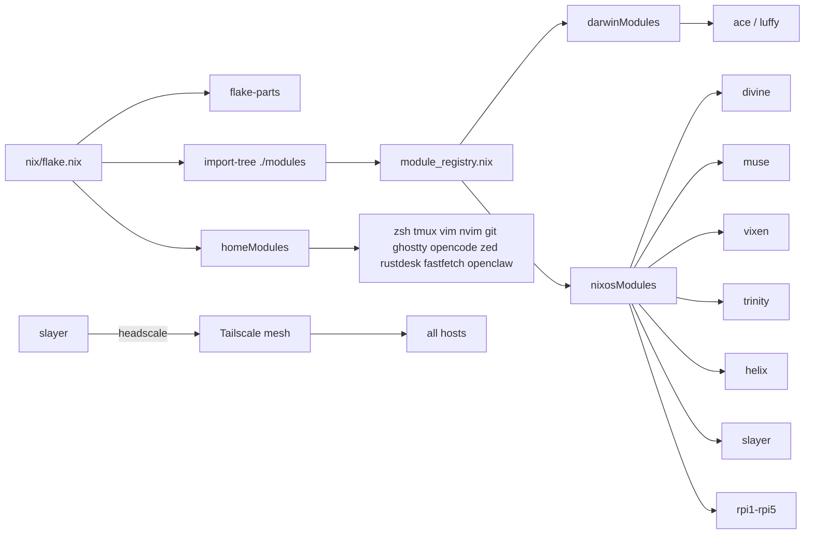

<div align="center">
  <h1>infra</h1>
  <p><strong>Homelab, workstation, and service orchestration from one Nix flake.</strong></p>
  <p>macOS on the desk, NixOS in the rack, Raspberry Pi at the edge, and a handful of storage and media boxes behind it.</p>
  <p>
    
    
    
    
  </p>
</div>

<p align="center">
  <a href="#overview">Overview</a> |
  <a href="#repository-map">Repository Map</a> |
  <a href="#host-inventory">Host Inventory</a> |
  <a href="#deployment-flow">Deployment Flow</a> |
  <a href="#nix-layout">Nix Layout</a> |
  <a href="#scripts">Scripts</a> |
  <a href="#secrets">Secrets</a> |
  <a href="#headscale-enrollment">Headscale Enrollment</a> |
  <a href="#reality-check">Reality Check</a>
</p>

---

## Overview

This repository is the control plane for a personal environment that mixes:

- `nix-darwin` for the daily macOS machines
- `home-manager` for shell, editor, and terminal UX
- `NixOS` for homelab nodes, cloud VPS, and Raspberry Pis
- `disko`, `mdadm`, `mergerfs`, and `snapraid` for storage-heavy hosts
- `agenix` for encrypted secrets
- `headscale` + `tailscale` for a self-hosted VPN mesh across all hosts
- thin deployment wrappers in [`scripts/`](./scripts) around `nh`

The center of gravity is [`nix/`](./nix). That is where the flake, reusable modules, and per-host compositions live. [`scripts/`](./scripts) adds the operator workflow on top: one script for Darwin, one script for remote NixOS hosts.

If you want to understand the repo fast, read it in this order:

1. [`nix/flake.nix`](./nix/flake.nix)
2. [`nix/modules/core/module_registry.nix`](./nix/modules/core/module_registry.nix)
3. [`nix/modules/hosts/`](./nix/modules/hosts)
4. [`scripts/deploy_macos.sh`](./scripts/deploy_macos.sh) and [`scripts/deploy_remote.sh`](./scripts/deploy_remote.sh)

---

## At A Glance

| Area | Purpose | Main files |
| --- | --- | --- |
| Flake entrypoint | Defines inputs and imports the entire module tree with `import-tree` and `flake-parts` | [`nix/flake.nix`](./nix/flake.nix) |
| Reusable system modules | Shared Darwin and NixOS building blocks | [`nix/modules/core`](./nix/modules/core), [`nix/modules/linux`](./nix/modules/linux), [`nix/modules/macos`](./nix/modules/macos) |
| Packages and home-manager bundles | Shell, editor, terminal, Git, and CLI UX | [`nix/modules/packages`](./nix/modules/packages) |
| Host compositions | Actual machines and their storage/service roles | [`nix/modules/hosts`](./nix/modules/hosts) |
| Deploy entrypoints | Thin wrappers around `nh` for switch/build/test flows | [`scripts/deploy_macos.sh`](./scripts/deploy_macos.sh), [`scripts/deploy_remote.sh`](./scripts/deploy_remote.sh) |
| Task helpers | Local operator utilities, flake update, and per-host deploy shortcuts | [`Justfile`](./Justfile), [`scripts/scram_sha_256.py`](./scripts/scram_sha_256.py) |
| Secrets | Encrypted payloads and recipient mapping | [`secerts/`](./secerts) |
| Editor config | Neovim config linked into home-manager out-of-store; Zed config baked into the store | [`dotfiles/nvim`](./dotfiles/nvim), [`dotfiles/zed`](./dotfiles/zed) |
| Extra experiments | Supplemental Nix snippets and Terraform bits | [`supplemental/`](./supplemental), [`terraform/`](./terraform) |

---

## Architecture


```mermaid
flowchart LR
    A[nix/flake.nix] --> B[flake-parts]
    A --> C[import-tree ./modules]
    C --> D[module_registry.nix]
    D --> E[darwinModules]
    D --> F[nixosModules]
    A --> G[homeModules]

    E --> H[ace / luffy]
    F --> I[divine]
    F --> J[muse]
    F --> K[vixen]
    F --> L[trinity]
    F --> M[helix]
    F --> N[slayer]
    F --> O[rpi1-rpi5]
    G --> P[zsh tmux vim nvim git ghostty opencode zed rustdesk fastfetch openclaw]

    slayer[slayer] -->|headscale| VPN[Tailscale mesh]
    VPN --> all[all hosts]
```

The design is intentionally simple:

- `flake.nix` defines inputs and delegates nearly everything else.
- `import-tree ./modules` bulk-imports the module tree.
- `module_registry.nix` turns internal `moduleRegistry.{darwin,nixos}` attributes into exported `flake.darwinModules` and `flake.nixosModules`.
- Host files under `nix/modules/hosts/**` assemble machines from those modules.
- Home-manager modules are exported independently under `flake.homeModules.*`.

That gives the repo a nice split:

- OS-level policy lives in reusable modules.
- Machine identity lives in host files.
- Deployment behavior lives in shell scripts.

---

## Repository Map

```text
.
|-- Justfile
|-- README.md
|-- dotfiles/
|   |-- nvim/
|   |-- openclaw/
|   `-- zed/
|-- nix/
|   |-- flake.nix
|   |-- flake.lock
|   |-- Justfile.backup
|   `-- modules/
|       |-- core/
|       |-- hosts/
|       |   |-- mac/
|       |   |-- rpi/
|       |   `-- server/
|       |       |-- divine/
|       |       |-- helix/
|       |       |-- muse/
|       |       |-- slayer/
|       |       |-- trinity/
|       |       `-- vixen/
|       |-- linux/
|       |   `-- gui/
|       |-- macos/
|       |-- packages/
|       |-- programs/
|       `-- services/
|-- scripts/
|   |-- deploy_macos.sh
|   |-- deploy_remote.sh
|   `-- scram_sha_256.py
|-- secerts/
|-- supplemental/
`-- terraform/
    `-- k8s/
```

### Top-level intent

- [`Justfile`](./Justfile) exposes deploy shortcuts for all hosts, flake/package update helpers, and the SCRAM utility.
- [`nix/`](./nix) is the actual product.
- [`scripts/`](./scripts) is the operator interface.
- [`secerts/`](./secerts) is the encrypted state that lets services boot correctly.
- [`nix/Justfile.backup`](./nix/Justfile.backup) is an archived copy of the older, much larger task runner.
- [`dotfiles/`](./dotfiles) shows up where a tool is managed out-of-store. Neovim uses a symlinked config; Zed and OpenClaw configs are read directly into the store at build time.
- [`supplemental/`](./supplemental) looks like a scratchpad/reference area for additional Nix snippets.
- [`terraform/`](./terraform) is adjacent infrastructure work, not part of the main flake deployment path.

---

## Host Inventory

### Exported By The Flake

These are the currently exported host names observed from `nix eval ./nix#...`.

| Host | Platform | Status | Role | Highlights |
| --- | --- | --- | --- | --- |
| `ace` | `aarch64-darwin` | active | Primary workstation | `nix-darwin`, `home-manager`, Homebrew, Ghostty, Zed, Opencode, Neovim, Git, tmux, RustDesk |
| `luffy` | `aarch64-darwin` | active | Secondary macOS machine | Same profile as `ace` plus AutoSSH tunnels to AWS RDS endpoints |
| `divine` | `x86_64-linux` | active | GPU and storage node | NVIDIA/CUDA stack, `ollama`, Samba, `mergerfs`, `mdadm` RAID1, NFS exports, KDE, Tailscale |
| `muse` | `x86_64-linux` | active | Storage/archive box | NVIDIA stack, Samba, `mergerfs`, `snapraid`, KDE, Tailscale |
| `trinity` | `x86_64-linux` | active | RustDesk relay node | Samba, RustDesk signal+relay server, Tailscale |
| `vixen` | `x86_64-linux` | active | Media and app node | NVIDIA stack, Samba, Jellyfin, Stash, Forgejo, Transmission, WAHA, WebDAV, rclone sync, Tailscale |
| `helix` | `x86_64-linux` | active | Desktop Linux node | KDE Plasma 6, Tailscale, Helium browser, full home-manager profile |
| `slayer` | `x86_64-linux` | active | Cloud VPS / VPN gateway | Headscale coordination server, Tailscale, minimal footprint |
| `rpi1` | `aarch64-linux` | active | Raspberry Pi utility node | Home Assistant, RPi boot tweaks, Tailscale, shared shell/user config |
| `rpi2` | `aarch64-linux` | active | Raspberry Pi node | Base RPi config, Tailscale, OpenClaw gateway service |
| `rpi3` | `aarch64-linux` | active | Raspberry Pi node | Base RPi config, Tailscale |
| `rpi4` | `aarch64-linux` | active | Raspberry Pi node | Base RPi config, Tailscale |
| `rpi5` | `aarch64-linux` | active | Raspberry Pi node | Base RPi config, Tailscale |
| `buttercup` | placeholder output | placeholder | Legacy or in-progress host | Comes from [`nix/modules/hosts/mac/mac_luffy.nix`](./nix/modules/hosts/mac/mac_luffy.nix), but currently defines an empty NixOS config |

### Machine Notes

#### `ace`

The primary Darwin workstation:

- uses `nix-homebrew` to manage taps declaratively
- pulls in `home-manager` modules for shell/editor UX including Zed and RustDesk
- adds developer toolchain packages: `clang-tools`, `arduino-cli`, `arduino-language-server`, `openjdk`, `rustc`, `cargo`, `sqld`
- installs GUI apps through Homebrew casks including Tailscale
- points local AI tooling at `divine` through `OLLAMA_HOST=192.168.2.5`

#### `luffy`

The secondary Darwin workstation, nearly identical profile to `ace`, plus:

- AutoSSH tunnels to external AWS Aurora RDS endpoints (dev on port `5421`, ppd on port `5433`) via `launchd` daemons
- These tunnels were previously on `trinity`; they now run natively on macOS using agenix-managed keys

#### `divine`

This is a mixed compute and storage node:

- `nvidia_gpu` for CUDA-enabled workloads
- `ollama` exposed on `0.0.0.0:11434`
- Samba share for `/mnt/mergefs`
- `mdadm` mirrored SSD array mounted at `/mnt/ssd`
- NFS exports for `/mnt/ssd` and `/mnt/nvme1`
- `mergerfs` spanning two HDD mounts under `/mnt/weed/*`
- KDE Plasma 6 desktop
- Tailscale via self-hosted Headscale

#### `muse`

This machine is a classic storage box:

- multiple XFS data disks
- `mergerfs` pool at `/mnt/mergefs`
- single parity disk through `snapraid`
- Samba sharing on top of the merged pool
- KDE Plasma 6 desktop
- Tailscale via self-hosted Headscale

#### `vixen`

This is the media-heavy application node:

- Samba for network file access
- Jellyfin with NVENC transcoding
- Stash with encrypted credentials and optional CUDA ffmpeg wrapper
- Forgejo bound to `0.0.0.0:9965` with encrypted admin credentials
- Transmission with mergefs-backed state and downloads directories
- WAHA (WhatsApp HTTP API) via podman container on port `8834`
- WebDAV at `http://vixen.ts.coupletruffle.com:8097` (Tailscale only)
  - Tabs/bookmarks backup: `files/backup/`
- `snapraid` plus `mergerfs` for the media pool
- rclone sync from `/mnt/mergefs` to both `divine` and `muse` every 6 hours, with 30-day snapshot retention
- Tailscale via self-hosted Headscale

#### `trinity`

This node has been repurposed from an AutoSSH relay to a RustDesk infrastructure host:

- Samba on top of a storage pool
- RustDesk signal + relay server (replaces the previous AutoSSH tunnel setup)
- AutoSSH tunnels have been migrated to `luffy` (macOS `launchd` daemons)
- Tailscale via self-hosted Headscale

#### `helix`

A NixOS desktop environment, currently running under Parallels on `aarch64` hardware:

- KDE Plasma 6 with full Wayland/SDDM setup
- full home-manager profile: zsh, tmux, Neovim, Zed, Ghostty, Git, Opencode
- Helium browser installed from the official `.deb` package
- Tailscale via self-hosted Headscale

#### `slayer`

A cloud VPS that acts as the VPN gateway for the entire fleet:

- runs `headscale` (self-hosted Tailscale coordination server) behind nginx with ACME TLS at `hs.coupletruffle.com`
- serves the Headscale web UI at `/web/`
- also runs `tailscale` itself to be a peer in the mesh
- minimal package footprint; no home-manager profile beyond the basics
- statically configured networking (Vultr/DigitalOcean style)

#### `rpi1`

This is the most configured Pi:

- generic shared user/system config
- Pi-compatible bootloader overrides
- Home Assistant enabled
- Tailscale via self-hosted Headscale

#### `rpi2`

Previously a placeholder; now a fully configured Pi node:

- base RPi config with home-manager (zsh, vim, git, autojump)
- OpenClaw gateway service (systemd user service, port `18789`)
- Tailscale via self-hosted Headscale

#### `rpi3` – `rpi5`

Previously placeholders; now fully configured Pi nodes:

- base RPi config with home-manager (zsh, vim, git, autojump)
- Tailscale via self-hosted Headscale

---

## Deployment Flow

There are two canonical operator paths in this repo.

### 1. Darwin Switches

For macOS machines:

```bash
./scripts/deploy_macos.sh ace
./scripts/deploy_macos.sh luffy
```

Or via the Justfile shortcut:

```bash
just deploy-mac ace
```

What the script does:

1. resolves the repository root
2. checks whether `nh` exists locally
3. runs either `nh darwin switch "$ROOT/nix#ace"` or `nix run nixpkgs#nh darwin switch "$ROOT/nix#ace"`

### 2. Remote NixOS Deployments

For remote Linux machines:

```bash
./scripts/deploy_remote.sh divine
./scripts/deploy_remote.sh muse test
./scripts/deploy_remote.sh vixen build
```

Supported actions:

- `switch`
- `boot`
- `test`
- `build`

What [`scripts/deploy_remote.sh`](./scripts/deploy_remote.sh) does:

1. resolves the repo root
2. validates the hostname against a hard-coded host/IP map
3. removes the old `~/infra-nixos` checkout if present and creates `~/infra` on the target host
4. `rsync`s the repo to the target, excluding `.git`, `.terraform`, and `result*`
5. runs `nh os <action> "$FLAKE_DIR/nix#<hostname>"` with both `--target-host` and `--build-host` set to the remote machine

That final detail matters: builds happen on the remote machine, not on the operator laptop.

### 3. Justfile Deploy Shortcuts

The `Justfile` now exposes per-host deploy targets and a parallel fleet deploy:

```bash
just deploy-divine          # switch divine
just deploy-vixen test      # test vixen
just deploy-helix           # switch helix
just deploy-slayer          # switch slayer
just deploy-rpi1            # switch rpi1
just deploy                 # deploy all remote hosts in parallel
just deploy-mac ace         # switch ace (darwin)
```

### Current Remote Host Map

The deploy script currently knows about:

| Host | IP |
| --- | --- |
| `trinity` | `192.168.2.2` |
| `rpi1` | `192.168.2.80` |
| `rpi2` | `192.168.2.81` |
| `rpi3` | `192.168.2.82` |
| `rpi4` | `192.168.2.83` |
| `rpi5` | `192.168.2.84` |
| `vixen` | `192.168.2.4` |
| `divine` | `192.168.2.5` |
| `muse` | `192.168.2.6` |
| `helix` | local / Parallels |
| `slayer` | cloud VPS (public IP) |

Notably absent:

- `ace` and `luffy`, which are handled by the Darwin script
- `buttercup`, which is only a placeholder flake output today

### Direct Commands Without The Wrapper Scripts

If you want to bypass the shell wrappers, the flake is still straightforward to drive manually:

```bash
nix flake show ./nix
nix eval --json ./nix#darwinConfigurations --apply builtins.attrNames
nix eval --json ./nix#nixosConfigurations --apply builtins.attrNames
```

With `nh` installed:

```bash
nh darwin switch ./nix#ace
nh os switch ./nix#divine --hostname divine
```

---

## Nix Layout

### Flake Entry

[`nix/flake.nix`](./nix/flake.nix) is compact on purpose.

It brings in:

- `flake-parts`
- `nixpkgs`
- `nix-darwin`
- `home-manager`
- `nix-homebrew`
- `disko`
- `agenix`
- `import-tree`

And then it mostly says:

- support Darwin and Linux on both `x86_64` and `aarch64`
- import the entire `./modules` tree
- let modules declare flake outputs

That makes the flake feel more like a registry than a giant hand-written `outputs = { ... }` block.

### Core Modules

| Module | Purpose |
| --- | --- |
| [`core/module_registry.nix`](./nix/modules/core/module_registry.nix) | Exports internal module registries as `flake.darwinModules` and `flake.nixosModules` |
| [`core/config.nix`](./nix/modules/core/config.nix) | Shared user, hostname, shell, locale, Nix settings, and environment defaults |
| [`core/shell_alias.nix`](./nix/modules/core/shell_alias.nix) | Cross-platform shell aliases for Git, file navigation, search, Terraform, and quality-of-life commands |
| [`core/shell_functions.nix`](./nix/modules/core/shell_functions.nix) | Tiny shell utilities like `x`, `dirsize`, and `extract` packaged as system binaries |

### OS Modules

| Module | Purpose |
| --- | --- |
| [`linux/system.nix`](./nix/modules/linux/system.nix) | Shared NixOS base: bootloader defaults, OpenSSH, Avahi, NetworkManager, user setup, Nix settings |
| [`linux/rpi.nix`](./nix/modules/linux/rpi.nix) | Raspberry Pi bootloader overrides using extlinux instead of systemd-boot |
| [`linux/nvidia_gpu.nix`](./nix/modules/linux/nvidia_gpu.nix) | NVIDIA driver stack, CUDA toolchain, VAAPI bridge, GPU env vars |
| [`linux/gui/kde.nix`](./nix/modules/linux/gui/kde.nix) | KDE Plasma 6 desktop: SDDM, Wayland, pipewire, printing, KDE Connect, standard KDE app set |
| [`macos/macos_config.nix`](./nix/modules/macos/macos_config.nix) | `nix-darwin` defaults for Dock, Finder, keyboard repeat, trackpad, tmux temp directory, and machine naming |
| [`macos/homebrew.nix`](./nix/modules/macos/homebrew.nix) | Declarative Homebrew management through `nix-homebrew` |

### Home Modules

The flake currently exports these reusable `home-manager` modules:

| Home module | What it manages |
| --- | --- |
| `autojump` | shell navigation |
| `fastfetch` | system summary output |
| `ghostty` | terminal config |
| `git` | Git, Delta, Lazygit, Mergiraf |
| `lf` | terminal file manager |
| `nvim` | Neovim package set and out-of-store config link |
| `openclaw` | OpenClaw gateway binary + systemd user service (port `18789`) |
| `opencode` | Opencode TUI and Ollama provider wiring |
| `rustdesk` | RustDesk remote desktop client, pre-configured to use `trinity` as signal+relay |
| `tmux` | tmux config and plugins |
| `vim` | fallback Vim config |
| `zed` | Zed editor with `dotfiles/zed/settings.json` and `dotfiles/zed/keymap.json` |
| `zsh` | shell behavior, prompt, completions, PATH, editor selection |

### Service And Program Modules

| Module | Purpose | Used by |
| --- | --- | --- |
| [`services/headscale.nix`](./nix/modules/services/headscale.nix) | Self-hosted Headscale VPN coordination server behind nginx with ACME TLS | `slayer` |
| [`services/tailscale.nix`](./nix/modules/services/tailscale.nix) | Tailscale client pointing at the self-hosted Headscale server | all Linux hosts |
| [`services/home_assistant.nix`](./nix/modules/services/home_assistant.nix) | Home Assistant base setup | `rpi1` |
| [`services/ollama.nix`](./nix/modules/services/ollama.nix) | local LLM endpoint using `ollama-cuda` | `divine` |
| [`services/samba.nix`](./nix/modules/services/samba.nix) | SMB share with macOS-friendly `fruit` tuning and password bootstrapping | `divine`, `muse`, `vixen`, `trinity` |
| [`services/webdav.nix`](./nix/modules/services/webdav.nix) | Apache httpd WebDAV server on port `8097` with agenix-backed htpasswd | `vixen` |
| [`services/rclone_sync.nix`](./nix/modules/services/rclone_sync.nix) | Scheduled rclone SFTP sync with rotating snapshot backups on the destination | `vixen` |
| [`linux/gui/kde.nix`](./nix/modules/linux/gui/kde.nix) | KDE Plasma 6 desktop environment | `divine`, `muse`, `helix` |
| [`programs/forgejo.nix`](./nix/modules/programs/forgejo.nix) | self-hosted Forgejo with encrypted admin bootstrap and mergefs-backed state | `vixen` |
| [`programs/jellyfin.nix`](./nix/modules/programs/jellyfin.nix) | GPU-accelerated Jellyfin service | `vixen` |
| [`programs/postgres.nix`](./nix/modules/programs/postgres.nix) | PostgreSQL module with SCRAM-backed user example | exported module, not currently enabled on an exported host |
| [`programs/stash.nix`](./nix/modules/programs/stash.nix) | Stash service, secret wiring, and optional CUDA ffmpeg wrapper | `vixen` |
| [`programs/transmission.nix`](./nix/modules/programs/transmission.nix) | Transmission daemon with mergefs-backed config and download paths | `vixen` |
| [`programs/waha.nix`](./nix/modules/programs/waha.nix) | WAHA WhatsApp HTTP API via podman container on port `8834` | `vixen` |

### Package Bundles

There are two main shared system package layers:

| Module | Intent |
| --- | --- |
| [`packages/common_packages.nix`](./nix/modules/packages/common_packages.nix) | day-to-day CLI basics like `bat`, `curl`, `eza`, `fd`, `fzf`, `jq`, `ripgrep`, `tree`, `wget` |
| [`packages/advanced_packages.nix`](./nix/modules/packages/advanced_packages.nix) | developer and infra tools like `go`, `gcc`, `kubectl`, `nodejs_22`, `pnpm`, `uv`, `nh`, `ollama`, and `agenix` |
| [`packages/helium.nix`](./nix/modules/packages/helium.nix) | Helium browser, packaged from the official `.deb` with `autoPatchelfHook`; `x86_64-linux` and `aarch64-linux` only | `helix` |

### Storage Pattern

This repo has a clear opinionated storage story for Linux servers:

| Host | Pattern |
| --- | --- |
| `divine` | `mdadm` RAID1 SSD mirror + dedicated NVMe + `mergerfs` over HDDs + NFS exports |
| `muse` | multiple data disks + `snapraid` parity + `mergerfs` pool |
| `trinity` | simplified storage; previously full snapraid/mergerfs, now reduced footprint |
| `vixen` | media disks + `snapraid` parity + `mergerfs` pool + GPU media workloads + app state under `/mnt/mergefs/programs` |

That combination is practical for homelab storage:

- `mergerfs` gives a single pooled view
- `snapraid` handles parity on mostly-static data
- Samba sits at the top for network access
- some hosts add media or AI workloads on top of the same pool

### Networking / VPN Layer

All Linux hosts now participate in a self-hosted Tailscale mesh:

- `slayer` runs `headscale` as the coordination server at `hs.coupletruffle.com`
- every other Linux host runs `tailscale` pointing at that server
- DNS magic resolves peers in the `ts.coupletruffle.com` domain
- the WebDAV endpoint on `vixen` is only reachable from within this mesh

---

## Scripts

The [`scripts/`](./scripts) directory is intentionally small. These scripts are wrappers, not full deployment frameworks.

### `deploy_macos.sh`

File: [`scripts/deploy_macos.sh`](./scripts/deploy_macos.sh)

Purpose:

- switch a Darwin configuration from the local machine

Behavior:

- assumes the first argument is the host name
- computes the repo root dynamically
- prefers local `nh`
- falls back to `nix run nixpkgs#nh`

Example:

```bash
./scripts/deploy_macos.sh ace
./scripts/deploy_macos.sh luffy
```

### `deploy_remote.sh`

File: [`scripts/deploy_remote.sh`](./scripts/deploy_remote.sh)

Purpose:

- push the repo to a remote host
- run a remote `nh os switch|boot|test|build`

Behavior:

- uses a hard-coded associative array of host names to IPs
- validates host name and action before doing any work
- syncs the repo via `rsync`
- uses SSH user `reezpatel`
- builds on the remote host
- currently keeps a staged remote checkout even though the active `nh` command still points at the local flake path

Example:

```bash
./scripts/deploy_remote.sh divine switch
./scripts/deploy_remote.sh vixen test
./scripts/deploy_remote.sh muse build
./scripts/deploy_remote.sh helix switch
./scripts/deploy_remote.sh slayer switch
```

### `scram_sha_256.py`

File: [`scripts/scram_sha_256.py`](./scripts/scram_sha_256.py)

Purpose:

- generate a PostgreSQL-style `SCRAM-SHA-256` password string from a plain-text input

Behavior:

- uses a `nix-shell` shebang with `python3.withPackages (ps: [ ps.scramp ])`
- accepts a single password argument
- prints a ready-to-paste `SCRAM-SHA-256...` string

Example:

```bash
./scripts/scram_sha_256.py 'secure_password123!'
```

### Why These Scripts Matter

They encode the operational assumptions of the repo:

- one operator identity
- known static LAN addresses
- flake root is `./nix`
- remote state should be refreshed by `rsync` before activation
- `nh` is the preferred frontend, but not a hard prerequisite

That is small, but it is exactly the right level of abstraction for a personal homelab.

---

## Secrets

Encrypted secrets live in [`secerts/`](./secerts).

Current secret files:

- `dev-rsa.age`
- `forgejo-password.age`
- `forgejo-runner-token.age`
- `frp-token.age`
- `headscale-auth-key.age`
- `opencode-auth.age`
- `ppd-rsa.age`
- `private-func.age`
- `samba-password.age`
- `stash-jwt-key.age`
- `stash-session-key.age`
- `stash-password.age`
- `webdav-password.age`

Recipients are declared in [`secerts/secrets.nix`](./secerts/secrets.nix).

### Where Secrets Are Used

| Secret | Consumed by | Purpose |
| --- | --- | --- |
| `private-func.age` | [`packages/zsh.nix`](./nix/modules/packages/zsh.nix) | sources private shell functions when present |
| `forgejo-password.age` | [`programs/forgejo.nix`](./nix/modules/programs/forgejo.nix) | keeps the Forgejo admin user's local password in sync during service startup |
| `forgejo-runner-token.age` | [`programs/forgejo.nix`](./nix/modules/programs/forgejo.nix) | reserved for the Forgejo actions runner wiring currently commented out in the module |
| `samba-password.age` | [`services/samba.nix`](./nix/modules/services/samba.nix) | bootstraps the Samba account password |
| `stash-jwt-key.age` | [`programs/stash.nix`](./nix/modules/programs/stash.nix) | JWT signing key |
| `stash-session-key.age` | [`programs/stash.nix`](./nix/modules/programs/stash.nix) | session store key |
| `stash-password.age` | [`programs/stash.nix`](./nix/modules/programs/stash.nix) | initial Stash admin password |
| `headscale-auth-key.age` | [`services/tailscale.nix`](./nix/modules/services/tailscale.nix) | Tailscale auth key for self-hosted Headscale enrollment |
| `webdav-password.age` | [`services/webdav.nix`](./nix/modules/services/webdav.nix) | WebDAV htpasswd credential |
| `dev-rsa.age` | [`hosts/mac/_auto_ssh.nix`](./nix/modules/hosts/mac/_auto_ssh.nix) | SSH key for AutoSSH dev tunnel on `luffy` |
| `ppd-rsa.age` | [`hosts/mac/_auto_ssh.nix`](./nix/modules/hosts/mac/_auto_ssh.nix) | SSH key for AutoSSH ppd tunnel on `luffy` |
| `frp-token.age` | reserved | FRP token, not currently wired to an active host module |
| `opencode-auth.age` | reserved | Opencode auth token |

### Typical Secret Workflow

If you are editing secrets with `agenix`, the shape is the usual one:

```bash
agenix -e secerts/private-func.age
```

The repo already includes `agenix` as a flake input and also adds the package in the advanced package bundle.

---

## Headscale Enrollment

All Linux hosts enroll into a self-hosted Tailscale mesh coordinated by Headscale on `slayer`. This section is the operational runbook for bringing the mesh up on a fresh deployment and for rotating the enrollment key.

### How Clients Reach The Server

The wiring is a single shared URL string:

- [`services/headscale.nix`](./nix/modules/services/headscale.nix) sets `server_url = "https://hs.coupletruffle.com"` behind nginx with ACME TLS.
- [`services/tailscale.nix`](./nix/modules/services/tailscale.nix) sets `--login-server=https://hs.coupletruffle.com` and reads the auth key from `headscale-auth-key.age`.
- Public DNS resolves `hs.coupletruffle.com` to `slayer`'s public IP; nginx terminates TLS and proxies to headscale on `127.0.0.1:8085`.
- The headscale CLI talks to the server over the unix socket `/run/headscale/headscale.sock` (via `/etc/headscale/config.yaml`), so root on `slayer` can drive it without a network flag.

Because every Linux host imports the same `tailscale` module and the same shared secret, the preauth key must be created **reusable** so all machines can enroll from one secret.

### Generating The Preauth Key (on `slayer`, as root)

```bash
sudo headscale users create default

# reusable = every host shares the one secret; long expiration; NOT ephemeral
sudo headscale preauthkeys create --user default --reusable --expiration 87600h

# confirm reusable=true
sudo headscale preauthkeys list --user default
```

Copy the `tskey-...` value that `preauthkeys create` prints.

### Rotating The Secret

From any machine whose SSH key is listed under `all` in [`secerts/secrets.nix`](./secerts/secrets.nix):

```bash
agenix -e secerts/headscale-auth-key.age
# paste ONLY the tskey-... value (no trailing newline), save, quit
```

This re-encrypts for every recipient, so all hosts can decrypt the rotated key.

### Deploying To Clients

The NixOS `tailscale` module auto-runs `tailscale up --auth-key ...` using `authKeyFile` on first boot. After rotating the secret:

```bash
./scripts/deploy_remote.sh <hostname> switch
sudo systemctl restart tailscaled   # if a node is already up, re-trigger enrollment
```

Repeat per host, or deploy the whole fleet:

```bash
just deploy
```

### Verifying

```bash
sudo headscale nodes list          # on slayer
tailscale status                   # on any client
```

### Optional: API Key For The Web UI

The Headscale web UI at `https://hs.coupletruffle.com/web/` needs an **API key** (separate from the preauth key above). Generate one and paste it into the UI login along with the server URL `https://hs.coupletruffle.com`:

```bash
sudo headscale apikeys create --expiration 87600h
```

### Gotchas

- **Bootstrap ordering on `slayer`:** it runs both headscale and tailscale. On first boot ACME issuance + nginx + headscale take a moment to come up; `tailscaled` retries until the control plane answers, so no systemd ordering change is needed.
- **Single-use keys break the shared-secret model:** a key created without `--reusable` lets only the first machine to boot enroll. Keep `--reusable` on the shared key.
- **Metrics exposure:** `metrics_listen_addr = "0.0.0.0:9090"` in [`headscale.nix`](./nix/modules/services/headscale.nix) is reachable on `slayer`'s public IP. Monitoring scrapes it over the mesh at `100.64.0.5:9090`. Bind to `127.0.0.1:9090` if public exposure is unwanted.

---

## `Justfile`

[`Justfile`](./Justfile) has grown beyond a single-helper tool. It now exposes:

- `just scram '<password>'` — delegates to [`scripts/scram_sha_256.py`](./scripts/scram_sha_256.py)
- `just update` — runs both `update-flake` and `update-packages`
- `just update-flake` — runs `nix flake update` in `nix/`
- `just update-packages` — iterates over all flake package outputs and calls `nix-update --flake`
- `just update-package <attr>` — updates a single named package attribute
- `just deploy` — deploys all remote hosts in parallel (trinity, vixen, divine, muse, helix, rpi1-rpi5, slayer)
- `just deploy-<host> [action]` — per-host shortcut, defaults to `switch`
- `just deploy-mac [host]` — Darwin deploy shortcut, defaults to `ace`

The previous larger task runner is preserved as [`nix/Justfile.backup`](./nix/Justfile.backup). Treat that file as historical reference, not the current entrypoint.

---

## Developer Experience

A lot of polish in this repo is not at the host level but in the day-to-day user environment:

- `zsh` with autosuggestions, syntax highlighting, spaceship prompt, autoenv, and shell completions
- `tmux` with plugin-driven status line and sensible defaults
- `git` with Delta, Lazygit, Mergiraf, and opinionated settings
- `ghostty` configured as the preferred terminal on the workstation
- `nvim` linked to [`dotfiles/nvim`](./dotfiles/nvim) instead of being baked into the store
- `zed` with settings and keymap read from [`dotfiles/zed/`](./dotfiles/zed) at build time
- `opencode` wired to a local Ollama-compatible endpoint on the LAN
- `rustdesk` pre-configured for the self-hosted relay on `trinity`
- a tiny root `Justfile` for generating SCRAM hashes, running updates, and deploying hosts

This makes the repo more than a homelab bootstrap. It is also a personal workstation profile.

---

## Reality Check

This repo is strong, but it is also visibly in motion. A few facts are worth calling out directly:

- `slayer` is the new Headscale coordination server; all Linux hosts now enroll via it. This means the VPN mesh depends on `slayer` being reachable.
- `trinity` has been substantially stripped down. The AutoSSH tunnels and snapraid/mergerfs storage stack have been removed. It now primarily hosts RustDesk infrastructure.
- AutoSSH tunnels to AWS Aurora endpoints moved from `trinity` (systemd) to `luffy` (macOS `launchd`). The keys are now managed by agenix rather than being plain files on disk.
- `rpi2` through `rpi5` are no longer placeholders — all have full NixOS configurations with Tailscale and a home-manager profile. `rpi2` additionally runs the OpenClaw gateway.
- `vixen` carries more than media workloads: Forgejo, Transmission, WAHA, WebDAV, and the rclone sync jobs all run here. The rclone sync writes snapshots of `/mnt/mergefs` to both `divine` and `muse` every 6 hours.
- `helix` is a new NixOS desktop node, currently targeting Parallels (`aarch64-linux` hardware) but the host file sets `system = "x86_64-linux"`. This may need reconciliation.
- `deploy_remote.sh` still performs an `rsync` to the remote host even though the active `nh` path is driven from the local flake path; that suggests an unfinished transition between two deployment styles.
- `forgejo-runner-token.age` is already present in the secret set, but the runner block inside [`programs/forgejo.nix`](./nix/modules/programs/forgejo.nix) is currently commented out.
- [`nix/modules/hosts/mac/mac_luffy.nix`](./nix/modules/hosts/mac/mac_luffy.nix) still exports an empty NixOS configuration named `buttercup`.
- the active secrets directory is named `secerts/`, so documentation and scripts should use that exact path unless the directory is renamed intentionally later.

None of that makes the repo weak. It just means this is a living operator repo, not a polished public template.

---

## Suggested Mental Model

If you are maintaining this repo, the easiest way to think about it is:

- `nix/flake.nix` is the index
- `nix/modules/**` is the library
- `nix/modules/hosts/**` is the inventory
- `scripts/**` is the deployment surface
- `secerts/**` is the private runtime state
- `slayer` is the network control plane (Headscale)
- `trinity` is the remote-access control plane (RustDesk)

That framing matches the code that is actually here.

---

## Useful Commands

```bash
# inspect exported outputs
nix flake show ./nix

# list exported Darwin hosts
nix eval --json ./nix#darwinConfigurations --apply builtins.attrNames

# list exported NixOS hosts
nix eval --json ./nix#nixosConfigurations --apply builtins.attrNames

# switch the workstation
./scripts/deploy_macos.sh ace

# deploy a remote host
./scripts/deploy_remote.sh divine switch

# build a remote host without switching
./scripts/deploy_remote.sh vixen build

# deploy all remote hosts in parallel
just deploy

# deploy a specific host
just deploy-helix
just deploy-slayer

# update flake inputs
just update-flake

# generate a SCRAM-SHA-256 string
just scram 'secure_password123!'

# or call the helper directly
./scripts/scram_sha_256.py 'secure_password123!'
```

---

## Closing Notes

This is a pragmatic personal infra repo.

It does not try to hide the operator. It names machines directly, uses real LAN IPs, exposes storage topology in host files, and keeps deployment wrappers understandable in one screen. That makes it easy to audit, easy to extend, and easy to fix when something breaks at 2 AM.
